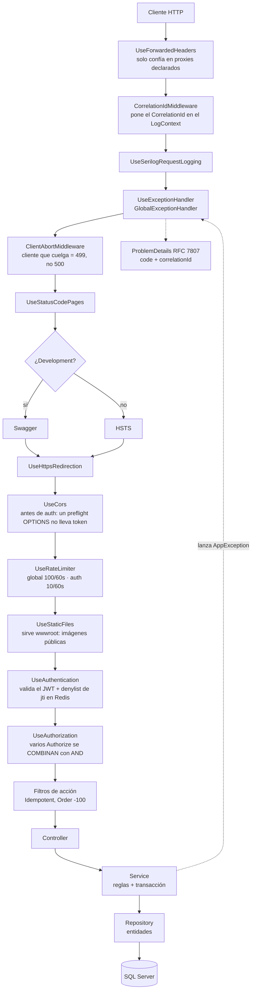
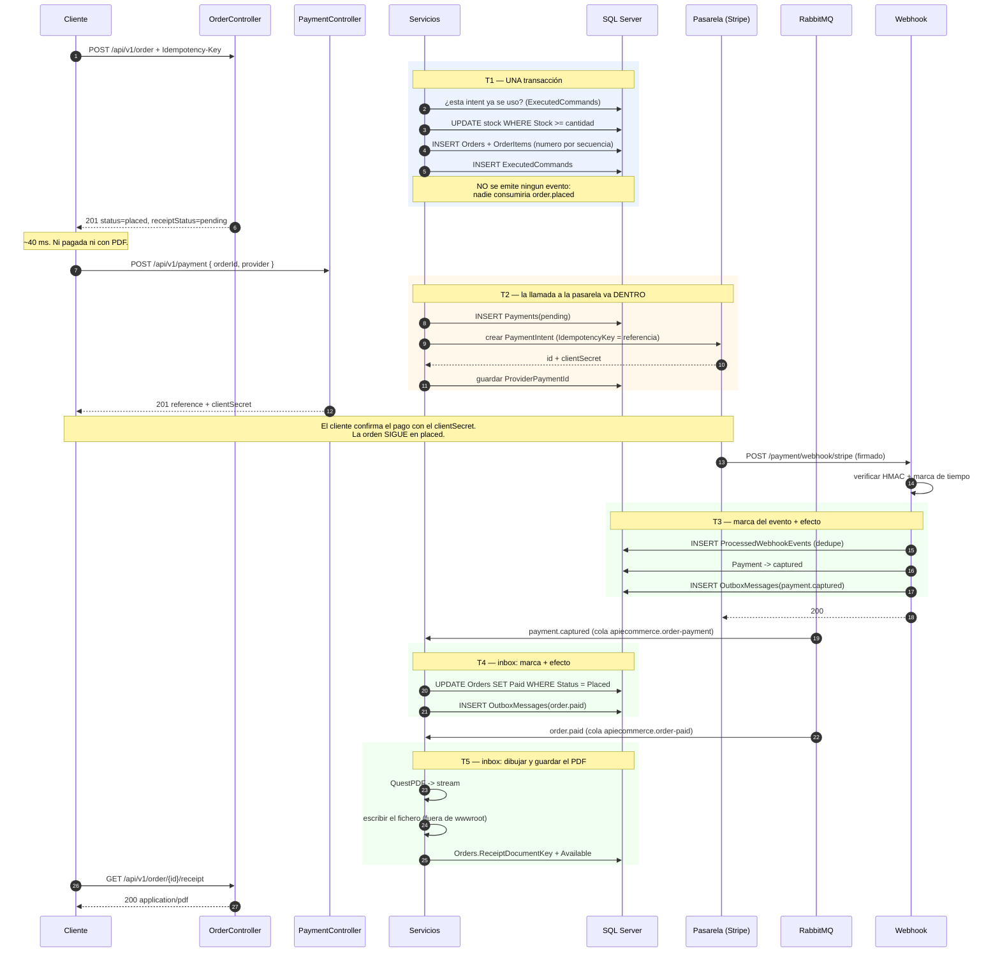
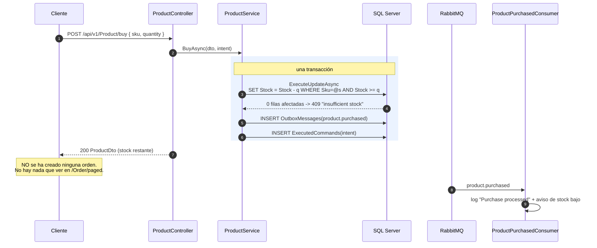
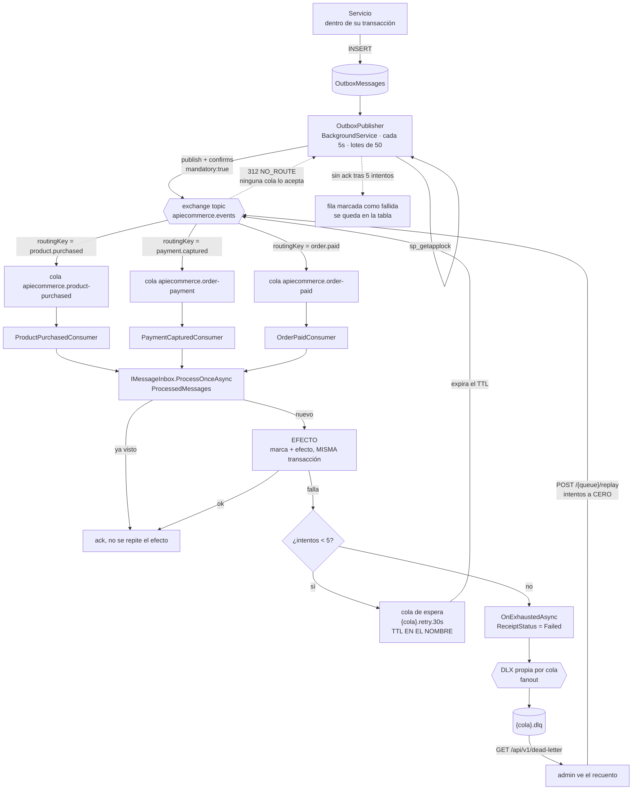
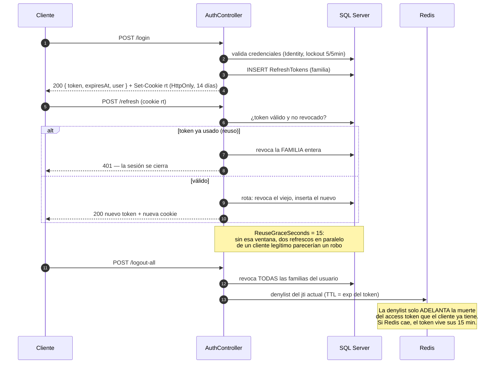
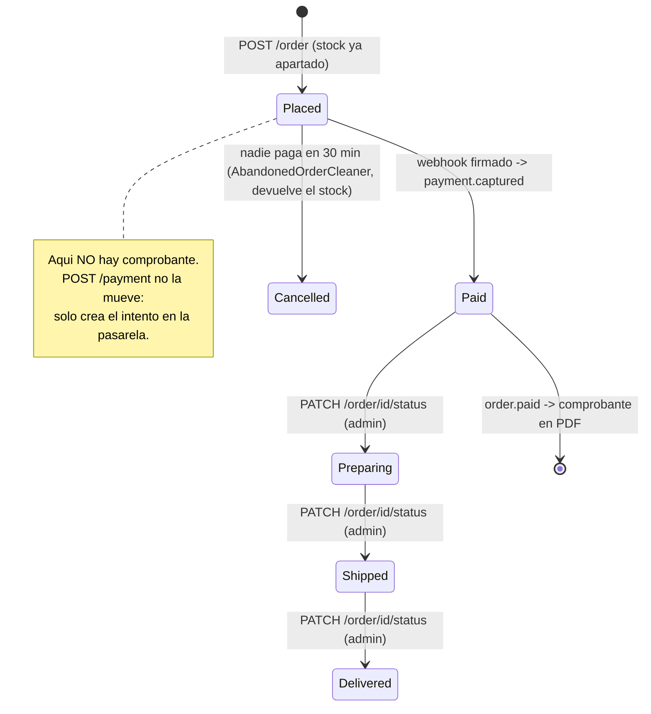

# ApiEcommerce — resumen ejecutable: qué endpoints hay y qué pasa por dentro

> Documento de **lectura**, no de arquitectura: sirve para responder rápido «¿qué hace este
> endpoint?» y «¿por dónde pasa una petición?». El porqué de cada decisión está en
> `AGENTS/docs/` y en `CLAUDE.md`; lo que hay aquí es el **mapa**.
>
> Estado: verificado contra el código el **2026-09-12** — las rutas de §1, una a una, contra
> los `[Http…]` de cada controller. Incluye `planning/24` (cotizar el carrito, mover la orden
> y los contadores del panel).
>
> Vivió hasta hoy en `AGENTS/__ref__/docs/summary/`, que está **gitignorado**: no viajaba en
> ningún commit, nadie más lo veía actualizado y ningún `git log` explicaba sus cambios. Por
> eso se quedó diciendo «tres contextos acotados» cuando ya eran cuatro. Aquí sí le aplica
> `rules.md` §12: **se actualiza en el mismo commit que el código que describe.**

---

## 0. En 30 segundos

```
Cliente ──HTTP──> Controller ──DTO──> Service ──entidad──> Repository ──> SQL Server
                                         │
                                         ├─ (misma transacción) marca de idempotencia -> ExecutedCommands
                                         └─ (misma transacción) evento -> OutboxMessages
                                                                              │
                                            OutboxPublisher (cada 5s) ────────┘
                                                                              ▼
                                                                          RabbitMQ
                                                                              ▼
                                                              Consumidor del slice (inbox)
                                                                              ▼
                                                                    EFECTO (PDF, stock…)
```

Cuatro contextos acotados: **Catalog** (categorías/productos), **Accounts**
(identidad/sesiones), **Ordering** (órdenes + comprobante PDF) y **Payments** (cobros contra
la pasarela). Cada uno con sus modelos, su servicio, su evento y su consumidor. `Shared/` es
mecanismo puro y **no nombra tipos de ningún slice**.

---

## 1. Todos los endpoints

Base: `http://localhost:8021/api/v1/…` — todas las rutas van versionadas por segmento.
`auth`: 🔓 anónimo · 🔒 cualquier usuario autenticado · 👑 rol `admin`.

### 1.1 `AuthController` — `/api/v1/Auth`

| Método | Ruta | Auth | Qué hace | Respuestas |
|---|---|---|---|---|
| POST | `/register` | 🔓 | Crea el usuario con rol `user`, devuelve access token + cookie `rt` | 201, 409 (nombre/email tomado), 422 |
| POST | `/login` | 🔓 | Valida credenciales, emite access token (15 min) + refresh en cookie HttpOnly | 200, 401, **403** (lockout: 5 fallos = 5 min) |
| POST | `/refresh` | 🔓 | Rota el refresh token de la cookie y emite uno nuevo. Detecta reuso → mata la familia entera | 200, 401 |
| POST | `/logout` | 🔓 | Revoca la sesión de esa cookie. Anónimo **a propósito**: al cerrar sesión lo normal es que el access token ya haya caducado | 204 |
| POST | `/password` | 🔒 | Cambia la contraseña **y corta todas las sesiones** | 204, 400, 422 |
| POST | `/logout-all` | 🔒 | Revoca todas las sesiones del usuario en todos los dispositivos | 204 |
| GET | `/me` | 🔒 | Perfil del usuario del token | 200, 401 |

### 1.2 `UserController` — `/api/v1/User` (todo 👑)

| Método | Ruta | Qué hace |
|---|---|---|
| GET | `/` | Listado paginado de usuarios |
| GET | `/{id}` | Detalle de un usuario |
| POST | `/{id}/roles` | Asigna un rol |
| DELETE | `/{id}/roles/{role}` | Quita un rol. Serializado con `sp_getapplock`: impide que dos admins se quiten el rol a la vez y el sistema se quede sin ninguno |
| POST | `/{id}/lock` | Bloquea la cuenta **y revoca sus sesiones** (bloquear sin revocar no bloqueaba nada) |
| POST | `/{id}/unlock` | Desbloquea |

### 1.3 `CategoryController` — `/api/v1/Category`

| Método | Ruta | Auth | Qué hace |
|---|---|---|---|
| GET | `/` | 🔓 | Todas las categorías. **Cacheada en Redis** (`CachedCategoryService`, decorador) |
| GET | `/paged` | 🔓 | Paginado (`?page=&pageSize=`) |
| GET | `/{id}` | 🔓 | Una categoría |
| POST | `/` | 👑 | Crea. **201 sin cuerpo**: el id viaja en la cabecera `Location` (no es un fallo) |
| PATCH | `/{id}` | 👑 | Actualiza parcial. Todo campo del DTO es nullable |
| DELETE | `/{id}` | 👑 | Borra. Invalida la cache |

### 1.4 `ProductController` — `/api/v1/Product`

| Método | Ruta | Auth | Qué hace |
|---|---|---|---|
| GET | `/` | 🔓 | Todos los productos |
| GET | `/paged` | 🔓 | Paginado |
| GET | `/{id}` | 🔓 | Un producto |
| GET | `/category/{categoryId}` | 🔓 | Productos de una categoría (404 si la categoría no existe) |
| GET | `/search?name=` | 🔓 | Búsqueda por nombre |
| POST | `/` | 👑 | Crea |
| PATCH | `/{id}` | 👑 | Actualiza parcial. **Concurrencia optimista**: `If-Match` con el `ETag` → 412 si otro admin editó antes |
| DELETE | `/{id}` | 👑 | Borra |
| POST | `/{id}/image` | 👑 | Sube la imagen (multipart, máx. 2 MB). Va **dentro de `wwwroot/`**: es pública |
| **POST** | **`/buy`** | 🔒 | **Descuenta stock por SKU. NO crea ninguna orden.** Idempotente (`Idempotency-Key`). Emite `product.purchased` |

### 1.5 `CartController` — `/api/v1/Cart`

| Método | Ruta | Auth | Qué hace |
|---|---|---|---|
| **POST** | `/quote` | 🔓 | Cotiza `{ items:[{sku,quantity}] }` con el **precio y el stock de este instante**. El cliente **nunca** manda precios |

> ⚠️ **Cotizar no aparta stock ni compromete el precio.** Es una foto: entre cotizar y
> comprar, las dos cosas pueden cambiar, y manda `POST /Order`.
>
> ⚠️ **Una línea sin stock vuelve marcada dentro de un 200**, no como 409 — al revés que el
> checkout. El front tiene que poder enseñar «solo quedan 2» y dejar ajustar la cantidad; un
> 409 deja el carrito inservible. Cada línea trae `status` (`ok` · `insufficient_stock` ·
> `not_found`), `available` y `maxQuantity`, y **el total solo suma las líneas servibles**.
>
> ⚠️ **El desglose lo calcula la misma pieza que el checkout** (`OrderPricing`). Calcularlo en
> los dos sitios es cómo se acaba cobrando un total distinto del que el cliente vio.

### 1.6 `OrderController` — `/api/v1/Order` (todo 🔒)

| Método | Ruta | Qué hace |
|---|---|---|
| **POST** | `/` | **El checkout.** Multi-línea, congela precios, numera la orden, aparta stock. Devuelve 201 con `status: "placed"` y `receiptStatus: "pending"` — **la orden NO nace pagada**. Idempotente |
| GET | `/{id}` | Una orden **del comprador autenticado**. La de otro devuelve **404**, no 403 |
| GET | `/paged` | Las órdenes **del comprador autenticado**, de la más reciente a la más antigua |
| GET | `/all` 👑 | **Todas las órdenes, de cualquier comprador.** Paginado + `?number=` (prefijo del número de orden). Ruta aparte, no un parámetro de `/paged` |
| **PATCH** | `/{id}/status` 👑 | Mueve la orden por su ciclo de entrega: `paid → preparing → shipped → delivered`. **204** también al repetir |
| GET | `/stats` 👑 | Recuento de órdenes por estado, para el panel |
| GET | `/{id}/receipt` | Descarga el PDF. 409 `receipt_not_ready` si aún se está generando, 409 `receipt_failed` si murió, 404 si la orden no es tuya |

> ⚠️ **`/Product/buy` y `/Order` conviven a propósito.** El primero es una operación de
> *catálogo*: mueve stock y **no deja rastro** — por eso no aparece en `/Order/paged`.
> El segundo es el *checkout* completo. Si esperas ver una orden, el endpoint es `POST /Order`.
>
> ⚠️ **`/Order/paged` filtra por comprador.** Un usuario recién registrado ve `200` con una
> página vacía aunque la base tenga 70 órdenes: son de otro. Para verlas todas hay que ser
> admin y usar **`/Order/all`**, que es una ruta distinta a propósito: quien puede ver las
> compras de terceros no es quien puede ver las suyas, y separar las rutas hace imposible que
> un fallo de filtrado convierta un listado propio en uno global.

> ⚠️ **`PATCH /{id}/status` no lleva `Idempotency-Key`, y es correcto.** La transición es un
> UPDATE condicional (`WHERE Status = @origen`), así que reenviarla no repite nada: si la
> orden ya estaba en el destino son **204**, y si venía de otro estado es **409
> `invalid_transition`**. Medido: 8 administradores simultáneos sobre la misma transición →
> **8×204** y una sola escritura.
>
> ⚠️ **El origen lo pone el servidor, no la petición**: si viniera del cliente se podría
> saltar un paso. Y **cancelar y reembolsar quedan fuera** — devolver dinero y stock tiene
> sus propias invariantes; cancelar una orden sin pagar ya es cosa de `AbandonedOrderCleaner`.
>
> ⚠️ **Mover una orden no emite ningún evento todavía**, por la misma razón que colocarla:
> nadie consume `order.shipped` y publicar sin cola vuelve como 312 NO_ROUTE.

### 1.7 `PaymentController` — `/api/v1/Payment` (todo 🔒)


| Método | Ruta | Qué hace |
|---|---|---|
| **POST** | `/` | Empieza a pagar una orden: `{ orderId, provider }`. Devuelve 201 con la referencia y el `clientSecret` de la pasarela. ⚠️ **201 NO significa cobrado**: solo que la pasarela aceptó el intento. Idempotente |
| GET | `/{id}` | Un pago del comprador autenticado |
| GET | `/paged` | Los pagos del comprador |
| GET | `/all` 👑 | Todos los pagos, con `?reference=` (prefijo) |
| **POST** | `/webhook/{provider}` 🔓 | Lo llama la pasarela. **Anónimo porque la firma ES la autenticación**, y sin rate limiter porque las pasarelas reintentan en ráfaga. Vive en un controller **aparte** (`PaymentWebhookController`, `[Route("api/v{version}/payment/webhook")]`): los `[Authorize]` se combinan con AND, así que la única forma de que una acción no herede el de su clase es no estar en esa clase |

> ⚠️ **Sin pasarela configurada la API arranca igual**, pero `POST /payment` devuelve **503
> `no_payment_provider`**. Cobrar no es una optimización: **no degrada en abierto**.
> Un proveedor que no existe es **400** enumerando los que sí.

### 1.8 Infraestructura

| Método | Ruta | Auth | Qué hace |
|---|---|---|---|
| GET | `/health` | 🔓 | *Liveness*: responde sin tocar ninguna dependencia. `[ApiVersionNeutral]`, **fuera** de `/api/v1` |
| GET | `/health/ready` | 🔓 | *Readiness*: SQL Server + Redis + backlog del outbox. Redis caído = `Degraded`, **nunca** `Unhealthy` |
| GET | `/api/v1/product/stats` · `/api/v1/user/stats` | 👑 | Contadores del catálogo y de usuarios. **No hay un `/admin/dashboard` único**: cada contexto publica los suyos y el panel compone con tres llamadas, en vez de obligar a un slice a conocer a los otros |
| GET | `/api/v1/dead-letter` | 👑 | Recuento de mensajes muertos por cola |
| POST | `/api/v1/dead-letter/{queue}/replay` | 👑 | Reemite la DLQ a su cola principal con el contador de intentos **a cero**. El nombre de cola se valida contra una allowlist de las suscripciones registradas |
| GET | `/swagger/index.html` | 🔓 | Solo en Development. Un documento por versión |

---

## 2. El viaje de CUALQUIER petición (el pipeline)

El orden **no es decorativo**: cada pieza está donde está por un bug medido.



**Quién decide qué:**

| Capa | Entra | Sale | Nunca |
|---|---|---|---|
| Controller | DTO, ruta, query | `IActionResult` con DTOs | `try/catch` de negocio, mapeadores, repositorios, entidades |
| Service | DTOs | DTOs | devolver entidades, conocer `HttpContext`, usar `AppDbContext` |
| Repository | entidades, ids | entidades, `bool`, `null` | conocer DTOs, lanzar excepciones de negocio |

El repositorio devuelve `null` → **el servicio** decide que eso es un 404 → **el handler global**
lo traduce a HTTP. Ningún controller lleva `try/catch`.

---

## 3. El flujo estrella: de `POST /order` al PDF, pasando por el cobro

Es el que mejor enseña la arquitectura completa: transacción + idempotencia + outbox +
broker + inbox + documento privado. Son **tres peticiones** del cliente y **una** de la
pasarela, y la orden no está pagada hasta la última.



### 3.1 «La misma transacción» — hay VARIAS, y ninguna hace esperar al cliente

Esto es lo que más se lee mal. **«Transacción» aquí NO significa «el cliente espera».**
Significa «estas escrituras se confirman todas o ninguna». Arriba hay cinco; las dos que
más se confunden son estas, y **el PDF no está en la que atiende tu petición**:

```
     TU PETICIÓN (hilo del request)                    SEGUNDO PLANO (nadie esperando)
     ───────────────────────────────                   ────────────────────────────────
  ┌─ T1 ── OrderService.PlaceAsync ─────┐
  │  ¿esta Idempotency-Key ya se usó?   │
  │  UPDATE Products SET Stock = ...    │
  │  INSERT Orders + OrderItems         │
  │  INSERT ExecutedCommands            │
  └─ COMMIT ────────────────────────────┘
              │
        201 Created  ──────► cliente             ~40 ms. NI PAGADA NI CON PDF.
              │
              └── (mas tarde) el webhook de la pasarela deja
                  OutboxMessages(payment.captured), y de ahi order.paid
                        │
                        ▼  OutboxPublisher (cada 5 s) ─► RabbitMQ ─► OrderPaidConsumer
                                                                          │
                                        ┌─ T2 ── MessageInbox.ProcessOnceAsync ──────┐
                                        │  INSERT ProcessedMessages (la marca)       │
                                        │  dibujar el PDF con QuestPDF               │
                                        │  ESCRIBIR EL FICHERO en disco  ← no es SQL │
                                        │  UPDATE Orders SET ReceiptDocumentKey=...  │
                                        └─ COMMIT ───────────────────────────────────┘
```

**Tu intuición es exactamente la implementación**: se responde en cuanto están los procesos
rápidos, y el PDF lo hace el consumidor por su cuenta. Lo que decía la frase «dentro de la
transacción» era **T2**, la del consumidor, no la tuya.

**Por qué T1 tiene que ser una sola transacción** (aunque sea rápida):

| Si esto se confirmara solo | Te quedarías con |
|---|---|
| el descuento de stock, sin la orden | stock cobrado y ninguna compra que lo justifique |
| la orden, sin la fila del outbox | una orden **sin comprobante para siempre**: nadie va a emitir ese evento |
| la fila del outbox, sin la orden | un evento sobre una orden que no existe |
| la marca de idempotencia, sin el efecto | el reintento del cliente diría «ya está hecho» y **no se hizo nada** |

Por eso la marca de idempotencia y el evento **no** viven en Redis ni se publican a mano:
tienen que caer con el mismo `ROLLBACK` que el resto. Es la diferencia entre una *garantía*
y una *optimización*.

**Por qué T2 también es una transacción, si ya nadie espera:** porque el broker entrega
*al menos una vez* y puede haber varias réplicas consumiendo. Si la marca «ya procesado» se
confirmara **antes** que el efecto, un PDF que falla dejaría el mensaje marcado y la
reentrega lo descartaría como duplicado: orden sin comprobante, para siempre y sin reintento.
Ya pasó, está en `IMessageInbox`.

**Y aquí está el único punto sucio de todo el diseño**: escribir un fichero **no se puede
deshacer**. `ROLLBACK` deshace filas, no borra ficheros. Así que dentro de T2 hay que elegir
un orden, y los dos son imperfectos:

| Orden | Si se cae justo en medio |
|---|---|
| **fichero → UPDATE → COMMIT** ← *el elegido* | queda un PDF que nadie referencia: **basura**, y el mensaje se reintenta |
| COMMIT → fichero | la orden dice `available` y apunta a un fichero **que no existe**: 404 eterno, y el mensaje ya se confirmó, así que **no hay reintento** |

Se prefiere **basura recolectable** a **pérdida irrecuperable**. Esa basura es el
*huérfano*, y la barre `ReceiptCleaner` cada 12 h con **24 h de gracia** — la gracia existe
porque, entre que se escribe el fichero y se confirma la fila, hay un instante en el que un
PDF **bueno** todavía no está referenciado; sin ella el recolector lo borraría en vuelo.

**Los otros dos detalles que se leen mal:**

1. El `201` vuelve **antes** de que exista el PDF. `receiptStatus: "pending"` es lo normal;
   pedir el comprobante en ese instante da **409 `receipt_not_ready`** — 409 y no 404 porque
   el documento va a existir, y un 404 le diría al cliente que deje de pedirlo.
2. Lo que se guarda en la base es **la clave opaca** (`2026/09/2bce667c….pdf`), nunca la
   ruta de disco. Migrar a S3 no obliga a reescribir ninguna fila.

---

## 4. `POST /Product/buy` — el flujo corto (y por qué no aparece en `/Order/paged`)



| | `POST /Product/buy` | `POST /Order` |
|---|---|---|
| Contexto | Catalog | Ordering |
| Líneas | una, por SKU | multi-línea |
| Deja fila | **no** | `Orders` + `OrderItems` |
| Número de orden | — | `ORD-2026-000070` (secuencia SQL) |
| Congela precio | no | **sí** |
| Comprobante | no | **PDF asíncrono** |
| Evento | `product.purchased` | ninguno al colocar; `order.paid` al cobrarse |

---

## 5. El camino de un evento, con sus fallos



**Las cuatro trampas que ya se pisaron aquí:**

- **Un evento sin cola que lo acepte no falla, se pierde de vista.** Por eso `mandatory: true`:
  vuelve como `312 NO_ROUTE` y el outbox lo cuenta como intento fallido en vez de darlo por bueno.
- **Redeclarar una cola con otros argumentos da `406 PRECONDITION_FAILED`** y deja la
  mensajería abajo. Es configuración, es permanente, reintentar no lo arregla. Por eso el TTL
  va **en el nombre** de la cola de espera (cambiarlo es aditivo).
- **Una DLX por cola.** Es `fanout`: dos colas apuntando a la misma repartirían los mensajes
  muertos de un slice a la dead-letter del otro.
- **Reemitir es una decisión humana, no un job.** Si algo agotó sus 5 intentos es porque
  estaba roto de verdad; automatizarlo esconde el incidente.

### Eventos que existen hoy

| Evento | Lo emite | Cola | Lo consume | Efecto |
|---|---|---|---|---|
| `product.purchased` | `ProductService.BuyAsync` | `apiecommerce.product-purchased` | `ProductPurchasedConsumer` | `IProductPurchasedHandler`: traza + aviso de stock bajo |
| `payment.captured` | `PaymentService` (al procesar el webhook) | `apiecommerce.order-payment` | `PaymentCapturedConsumer` (**en Ordering**) | `IOrderPaymentHandler`: pasa la orden a `Paid` y emite `order.paid` |
| `order.paid` | `OrderPaymentHandler` | `apiecommerce.order-paid` | `OrderPaidConsumer` | `IReceiptGenerator`: dibuja el PDF y apunta la orden a él |

El evento **y su consumidor viven en el slice que los emite**. `Shared/Messaging` solo pone
el mecanismo (`EventConsumer<TConsumer,TEvent>`), y el **efecto vive fuera del
`BackgroundService`** para poder probarlo sin broker.

⚠️ **`payment.captured` es la excepción: lo emite Payments y lo consume Ordering.** Y cuando
un slice reacciona al evento de otro, **se copia el contrato, no se referencia el tipo**:
`Ordering.PaymentCapturedNotice` es una copia deliberada con solo los campos que Ordering
usa. El contrato de un evento de integración es su **JSON**, no una clase .NET compartida.

---

## 6. Autenticación: sesiones que sí se pueden cortar



- **Access token**: 15 minutos, no revocable por diseño → la ventana es corta a propósito.
- **Refresh token**: 14 días, en cookie `HttpOnly`, **rotativo**, con detección de reuso.
- **Cambiar la contraseña corta todas las sesiones.** Bloquear a un usuario también (sin eso,
  bloquear no bloqueaba nada: el token seguía sirviendo).

---

## 7. Los procesos de fondo

Siete `BackgroundService`. Todos con el mismo blindaje: `catch (OperationCanceledException)`
al parar y `catch (Exception)` **sin filtro** — un `BackgroundService` que lanza muere y no
vuelve, y desde .NET 6 el default `StopHost` **tumba la API entera**.

| Servicio | Cada | Qué hace | Se apaga con |
|---|---|---|---|
| `OutboxPublisher` | 5 s | Publica lotes de 50 de `OutboxMessages` al broker | `RabbitMq:ConnectionString` vacío |
| `OutboxCleaner` | 6 h | Purga `OutboxMessages` y `ExecutedCommands` con más de 14 días | `Outbox:RetentionDays` |
| `ProductPurchasedConsumer` | — | Escucha `product.purchased` (prefetch 10) | sin broker |
| `OrderPaidConsumer` | — | Escucha `order.paid` → genera el PDF | sin broker |
| `PaymentCapturedConsumer` | — | Escucha `payment.captured` → pasa la orden a `Paid` | sin broker |
| `ReceiptCleaner` | 12 h | Borra PDFs huérfanos con >24 h (`OrphanGraceHours`) | `Documents:CleanupIntervalHours = 0` |
| `AbandonedOrderCleaner` | 10 min | Cancela órdenes sin pagar y **devuelve su stock** | `Payments:CleanupIntervalMinutes = 0` |
| `RefreshTokenCleaner` | 6 h | Purga refresh tokens caducados (arranca 2 min tarde para no competir con el seeding) | — |

> ⚠️ `Outbox:RetentionDays` tiene que **cubrir el peor reintento de un cliente**: pasado ese
> plazo la misma `Idempotency-Key` vuelve a ejecutar de verdad.
>
> ⚠️ `Documents:OrphanGraceHours` es **la única línea de toda la configuración que no se puede
> equivocar**: sin gracia, el recolector borraría comprobantes buenos a mitad de vuelo.

---

## 8. Las tablas que sostienen las garantías

| Tabla | Para qué | Quién la escribe |
|---|---|---|
| `Categories`, `Products` | catálogo | Catalog |
| `Orders`, `OrderItems` | órdenes (número por secuencia `OrderNumbers`) | Ordering |
| `Payments` | cobros (referencia por secuencia `PaymentReferences`) | Payments |
| **`ProcessedWebhookEvents`** | dedupe del webhook: las pasarelas reenvían por diseño | Payments, en la misma transacción que el efecto |
| `AspNetUsers`, `AspNetRoles`… | identidad | Identity |
| `RefreshTokens` | sesiones revocables, en familias | Accounts |
| **`ExecutedCommands`** | **la garantía de idempotencia**: la clave primaria es el árbitro entre réplicas | el servicio, en la misma transacción que el efecto |
| **`OutboxMessages`** | eventos pendientes de publicar | el servicio, en la misma transacción que el efecto |
| **`ProcessedMessages`** | el inbox: deduplicación por `MessageId` | el consumidor, en la misma transacción que el efecto |

**Estados:**

- `OrderStatus`: **`Placed(0)`** ← nace aquí · `Paid(1)` · `Preparing(2)` · `Shipped(3)` · `Delivered(4)` · `Cancelled(5)`
- `PaymentStatus`: `Pending(0)` → `Captured(1)` · `Failed(2)` · `Cancelled(3)`
- `ReceiptStatus`: `Pending(0)` → `Available(1)` · `Failed(2)`

---

## 9. Qué pasa si se cae cada dependencia

| Cae | La app | Qué se degrada |
|---|---|---|
| **SQL Server** | no hace nada útil | es la fuente de verdad, no hay plan B |
| **Redis** | **arranca igual** | cache → se lee de la base · atajo de idempotencia → se salta (**la garantía sigue en la transacción**) · denylist de `jti` → el token vive sus 15 min. `/health/ready` = `Degraded`, nunca `Unhealthy` |
| **RabbitMQ** | **arranca igual** | los eventos se acumulan en `OutboxMessages` hasta que vuelva. Nada se pierde; los PDFs se generan tarde |
| **La pasarela de pago** | arranca igual | `POST /payment` da **503** con `Retry-After`. **No degrada en abierto**: aceptar un pago que no se va a cobrar es lo peor que podría hacer |
| **Disco de documentos** | arranca igual | la orden se coloca, el comprobante falla → 5 reintentos → DLQ → `ReceiptStatus = Failed` → recuperable con `replay` |

La regla: **una optimización tiene fuente de verdad alternativa y degrada en abierto; una
garantía no tiene plan B, así que no puede vivir fuera de la transacción que protege.**
Y renunciar a una garantía **lo decide el cliente** (no mandar `Idempotency-Key`), nunca
nosotros en silencio.

---

## 10. Recorrido de humo — ver todo el flujo en 6 comandos

```sh
API=http://localhost:8021/api/v1

# 1. registrarse (o loguearse como admin, que es quien tiene las órdenes de prueba)
TOKEN=$(curl -s -X POST $API/Auth/login -H 'Content-Type: application/json' \
  -d '{"username":"admin","password":"<Seed:AdminPassword de user-secrets>"}' | jq -r .token)

# 2. ver el catálogo (anónimo)
curl -s $API/Product/paged | jq '.items[] | {sku, name, stock}'

# 3. CHECKOUT: esto sí crea una orden
ORDER=$(curl -s -X POST $API/Order -H "Authorization: Bearer $TOKEN" \
  -H 'Content-Type: application/json' -H "Idempotency-Key: $(uuidgen)" \
  -d '{"items":[{"sku":"MQ-20722","quantity":1}],"customerName":"Adrian"}')
echo $ORDER | jq '{id, number, receiptStatus}'      # -> receiptStatus: "pending"

# 4. mis órdenes (solo las MÍAS)
curl -s "$API/Order/paged?page=1&pageSize=5" -H "Authorization: Bearer $TOKEN" | jq '.items[].number'

# 4b. PAGAR: la orden sigue en "placed" hasta que la pasarela lo confirme
ID=$(echo $ORDER | jq -r .id)
curl -s -X POST $API/Payment -H "Authorization: Bearer $TOKEN" \
  -H 'Content-Type: application/json' -H "Idempotency-Key: $(uuidgen)" \
  -d "{\"orderId\":$ID,\"provider\":\"stripe\"}" | jq '{reference, status, clientSecret}'
#    Sin credenciales de Stripe esto responde 503 no_payment_provider, que es lo correcto.

# 5. el comprobante, un par de segundos DESPUES de que el webhook confirme el cobro
curl -s -o receipt.pdf -w '%{http_code}\n' "$API/Order/$ID/receipt" -H "Authorization: Bearer $TOKEN"

# 6. ¿algo murió por el camino?
curl -s $API/dead-letter -H "Authorization: Bearer $TOKEN" | jq
```

Repetir el paso 3 **con la misma `Idempotency-Key`** devuelve la misma orden y la cabecera
`Idempotency-Replayed: true`, sin cobrar dos veces ni descontar stock de nuevo.

### 10.1 Hacer admin a mi usuario

No hay comando de consola: el rol se asigna **por la API**, y quien lo hace tiene que ser ya
admin — por eso existe el `admin` sembrado al arrancar (`Seed:AdminPassword`).

```sh
API=http://localhost:8021/api/v1

# 1. mi id de usuario (con MI token)
MI_ID=$(curl -s $API/Auth/me -H "Authorization: Bearer $MI_TOKEN" | jq -r .id)

# 2. el token del admin sembrado
ADMIN=$(curl -s -X POST $API/Auth/login -H 'Content-Type: application/json' \
  -d '{"username":"admin","password":"<Seed:AdminPassword>"}' | jq -r .token)

# 3. asignarme el rol -> 204 No Content
curl -s -o /dev/null -w '%{http_code}\n' -X POST "$API/User/$MI_ID/roles" \
  -H "Authorization: Bearer $ADMIN" -H 'Content-Type: application/json' \
  -d '{"role":"admin"}'

# 4. VOLVER A LOGUEARME: el rol viaja dentro del JWT, y el token que ya tengo no lo trae
```

> ⚠️ El paso 4 no es opcional. Los roles son claims **firmados dentro del access token**: el
> que tienes en la mano se emitió antes y sigue diciendo `user` hasta que caduque (15 min).
>
> Quitarlo: `DELETE $API/User/$MI_ID/roles/admin`. Esa operación está serializada con
> `sp_getapplock` para que dos admins no puedan quitarse el rol a la vez y dejar el sistema
> sin ninguno.

---

## 11. El ciclo de vida de una orden, desde que se coloca



**Lo que hay que entender de este diagrama:**

- **Solo un cobro capturado pasa una orden a `Paid`** — no la respuesta de nuestra API.
- Las transiciones son **condicionales dentro del `UPDATE`** (`WHERE Status = Placed`), y eso
  es lo que las hace idempotentes ante un reenvío del webhook y lo que impide que un webhook
  tardío **resucite una orden ya cancelada** cuyo stock ya volvió al catálogo.
- **Colocar una orden no emite ningún evento hoy**: nadie consumiría `order.placed`, y
  publicar sin cola que lo acepte vuelve como `312 NO_ROUTE` y agota el outbox en silencio.
- La ventana de reserva es **la contrapartida obligatoria** de que la orden nazca sin pagar.

### Elegir con qué se paga

`IPaymentGateway` es **Strategy**, no puerto elegido en el composition root, y es la única
excepción consciente a la regla de §5.4 de `CLAUDE.md`: allí quien elige la implementación es
la **infraestructura** (disco o S3); aquí quien elige es **el comprador**, en cada petición.
`PaymentGatewayRegistry` resuelve todas las `IPaymentGateway` registradas por `Provider`, así
que **añadir PayPal es una clase y un `AddSingleton`** — ni el servicio ni el controller se
tocan.

---

## 12. Lo que NO existe todavía

- **`Shipping`** está previsto como contexto acotado y no existe. Hoy el envío es un cambio de
  estado que hace un administrador a mano (`PATCH /order/{id}/status`), sin transportista ni
  seguimiento.
- **Cancelar o reembolsar una orden.** `PATCH /status` solo cubre el camino de entrega.
- **Reembolsos, pagos parciales y PayPal.** El diseño está hecho para que PayPal quepa; no se
  añade sin necesitarlo porque sería adivinar su forma.
- **Stripe necesita credenciales del owner** (`Payments:Stripe:SecretKey` y `WebhookSecret` en
  user-secrets) y, para recibir webhooks de verdad, una URL pública.
- **No hay alerta cuando la DLQ crece**: hay que mirar `GET /api/v1/dead-letter`.
- **La CI está escrita pero desactivada** (`AGENTS/ci/`): el único check es el que corras tú.
